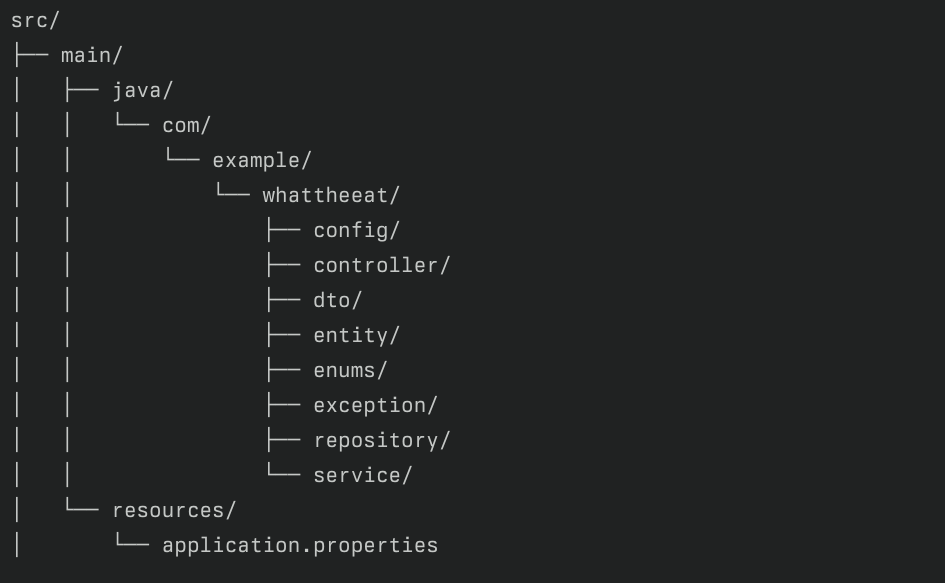

# WhatTheEat

# What The Eat

음식 주문 및 배달 서비스를 제공하는 Spring Boot 기반의 웹 애플리케이션입니다.

## 기술 스택

- Java 17
- Spring Boot 3.4.0
- MySQL
- JPA/Hibernate
- Lombok
- BCrypt

## 주요 기능

### 사용자 관리
- 회원가입/로그인
- 권한 관리 (고객/사장님)
- 비밀번호 암호화

### 가게 관리
- 가게 등록/수정/삭제
- 영업 시간 설정
- 최소 주문 금액 설정

### 메뉴 관리
- 메뉴 등록/수정/삭제
- 가격 설정
- 메뉴 상태 관리

### 주문 시스템
- 메뉴 주문
- 주문 상태 관리
    - ORDERED: 주문 접수
    - ACCEPTED: 주문 수락
    - PREPARING: 조리 중
    - COOKED: 조리 완료
    - DELIVERING: 배달 중
    - DELIVERED: 배달 완료
- 최소 주문 금액 검증
- 영업 시간 검증

### 리뷰 시스템
- 주문별 리뷰 작성
- 별점 평가 (1-5점)
- 리뷰 내용 작성

## API 엔드포인트

### 메뉴 관련
```http
POST /menus/shop/{shopId} - 메뉴 생성
PUT /menus/{menuId} - 메뉴 수정
DELETE /menus/{menuId} - 메뉴 삭제
POST /orders - 주문 생성
PUT /orders/{orderId}/status - 주문 상태 변경
GET /orders - 주문 내역 조회
```

### 보안
- 세션 기반 인증
- BCrypt 비밀번호 암호화
- 인터셉터를 통한 권한 검증
- CSRF 보호
### 예외 처리
- GlobalExceptionHandler를 통한 통합 예외 처리
- 커스텀 예외 처리
- 유효성 검사 예외 처리

### 프로젝트 구조


### 빌드 및 실행

- ./gradlew build
- java -jar build/libs/whattheeat-0.0.1-SNAPSHOT.jar

### 의존성
```http
dependencies {
implementation 'at.favre.lib:bcrypt:0.10.2'
implementation 'org.springframework.boot:spring-boot-starter-thymeleaf'
implementation 'org.springframework.boot:spring-boot-starter-web'
implementation 'org.springframework.boot:spring-boot-starter-data-jpa'
implementation 'org.springframework.boot:spring-boot-starter-validation'
compileOnly 'org.projectlombok:lombok'
runtimeOnly 'com.mysql:mysql-connector-j'
}
```